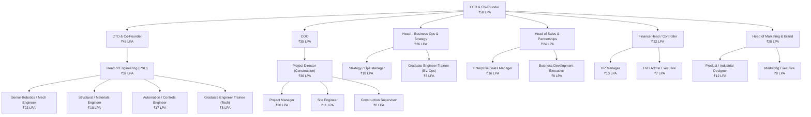

```mermaid
graph TD
    A["CEO & Co-Founder<br/>₹50 LPA"] --> B["CTO & Co-Founder<br/>₹45 LPA"]
    A --> C["COO<br/>₹35 LPA"]

    %% Engineering & Technology
    B --> D["Head of Engineering (R&D)<br/>₹32 LPA"]
    D --> D1["Senior Robotics / Mech Engineer<br/>₹22 LPA"]
    D --> D2["Structural / Materials Engineer<br/>₹18 LPA"]
    D --> D3["Automation / Controls Engineer<br/>₹17 LPA"]
    D --> D4["Graduate Engineer Trainee (Tech)<br/>₹8 LPA"]

    %% Construction & Operations
    C --> E["Project Director (Construction)<br/>₹30 LPA"]
    E --> E1["Project Manager<br/>₹20 LPA"]
    E --> E2["Site Engineer<br/>₹11 LPA"]
    E --> E3["Construction Supervisor<br/>₹8 LPA"]

    %% Business Operations & Strategy
    A --> F["Head – Business Ops & Strategy<br/>₹26 LPA"]
    F --> F1["Strategy / Ops Manager<br/>₹18 LPA"]
    F --> F2["Graduate Engineer Trainee (Biz Ops)<br/>₹8 LPA"]

    %% Sales & Partnerships
    A --> G["Head of Sales & Partnerships<br/>₹24 LPA"]
    G --> G1["Enterprise Sales Manager<br/>₹16 LPA"]
    G --> G2["Business Development Executive<br/>₹9 LPA"]

    %% Finance & HR
    A --> H["Finance Head / Controller<br/>₹22 LPA"]
    H --> H1["HR Manager<br/>₹13 LPA"]
    H --> H2["HR / Admin Executive<br/>₹7 LPA"]

    %% Design & Marketing
    A --> I["Head of Marketing & Brand<br/>₹20 LPA"]
    I --> I1["Product / Industrial Designer<br/>₹12 LPA"]
    I --> I2["Marketing Executive<br/>₹8 LPA"]
```
